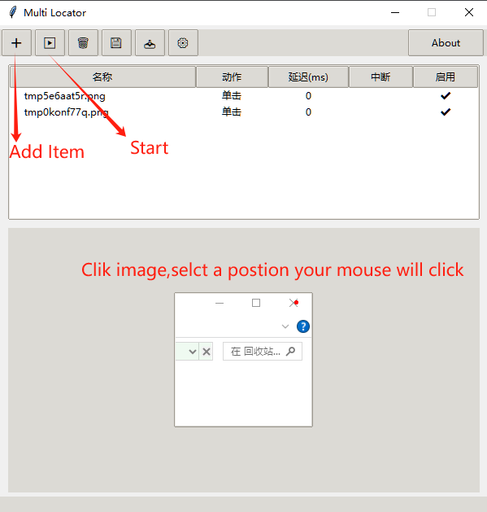

# AutoClick

AutoClick provides a simple way to locate a template image inside a bigger screenshot and automate mouse actions. It includes a command line example and a small GUI for managing multiple templates.



## Project Background

AutoClick was inspired by my other open source project KeyleFinder. It was created to accelerate automated debugging workflows. Many thanks to CodeX for the wonderful collaboration.

## Features

- ORB based feature matching with a template fallback
- Screenshot cropping interface for quickly creating templates
- Global hotkey to trigger searches
- Optional PyAutoGUI fail-safe toggle
- Trash button to delete items from the list
- Works on Windows, Linux and macOS

## Requirements

- Python 3.8+
- `opencv-python-headless`
- `numpy`
- `Pillow`
- `pyautogui`
- `keyboard` (Windows/Linux)
- `pynput` (macOS)
- On macOS the packages `pyobjc-core` and `pyobjc` are required for screenshots
- On macOS you also need to grant "Accessibility" permission to your Python
  interpreter or terminal in **System Preferences → Security & Privacy** so the
  tool can control the mouse and keyboard.

Install the dependencies with:

```bash
pip install opencv-python-headless numpy Pillow pyautogui keyboard pynput pyobjc-core pyobjc
```

## Usage

Run the test script to see the matcher in action:

```bash
python KeyleFinderModuleTest.py
```

Launch the GUI tool with:

```bash
python gui_locator_multi.py
```

Press the configured hotkey (default `F2`) to scan the screen for your templates.

**Auto Start** is now enabled by default, causing the start button to run all
items from top to bottom automatically. When unchecked, only the currently
selected item is executed when you press start.

The settings window also provides a **Fail-safe** option. When enabled (the
default), moving the mouse to any screen corner aborts automation. You can
disable this behavior by unchecking the box or passing `--disable-failsafe` to
`cli_workflow.py`.

Use **Hide window while searching** if you don't want the application window to
appear in screenshots during template matching. When unchecked, the window
shrinks to 270 pixels high instead of disappearing.

## CLI Workflow Tool

You can execute a sequence of template clicks directly from the command line using `cli_workflow.py`:

```bash
python cli_workflow.py workflow.json
```

`workflow.json` is compatible with files exported from the GUI. Each entry contains base64 encoded image data and an optional `double_click` flag.

## 中文简介

AutoClick 是一个自动点击工具，通过配置模板图像来实现开发者自动化工作流程。

### 功能

- 基于 ORB 的特征匹配，失败时回退到模板匹配
- 方便的截图修剪界面用于创建模板
- 全局热键触发搜索
- 提供删除按钮可移除列表项
- 支持 Windows、Linux 和 macOS
- 在 macOS 中，需在「系统设置 → 隐私与安全 → 辅助功能」中为 Python 或终端
  授权，以便程序能够控制鼠标和键盘

### 使用

1. `python KeyleFinderModuleTest.py`运行测试
2. `python gui_locator_multi.py`启动图形界面
3. `python cli_workflow.py workflow.json`从命令行执行工作流程

### 操作步骤

1. 克隆本仓库并安装依赖：
   ```bash
   pip install opencv-python-headless numpy Pillow pyautogui keyboard pynput pyobjc-core pyobjc
   ```
2. 运行 `python KeyleFinderModuleTest.py` 体验基础功能。
3. 执行 `python gui_locator_multi.py` 打开界面，添加模板并配置热键。
4. 按下配置的热键（默认 `F2`）进行匹配。
5. 需要批量操作时，可运行 `python cli_workflow.py workflow.json`。

### 免责声明

本工具旨在加速自动化调试，请勿将其用于任何非法用途。

## Latest Build

<!-- BUILD LINKS START -->
- [Windows](https://github.com/KeyleXiao/AutoClick/releases)
- [macOS](https://github.com/KeyleXiao/AutoClick/releases)

<!-- BUILD LINKS END -->
